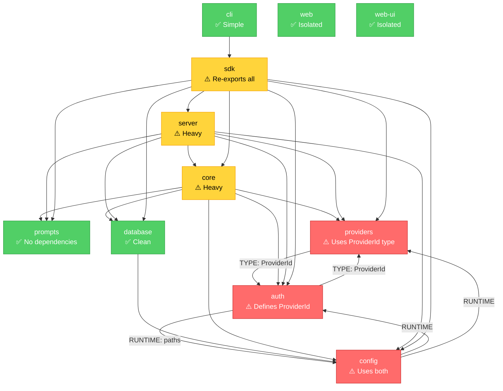
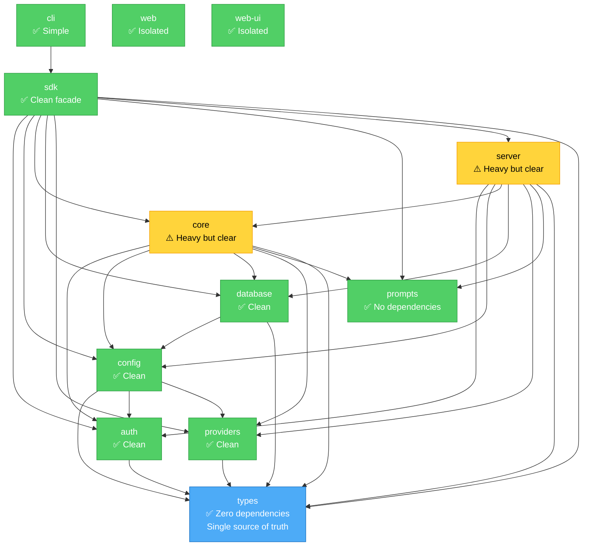

# Package Dependency Graph

## Current State (with Circular Dependencies)



## Proposed State (After Refactoring)



## Dependency Levels

### Level 0: Foundation (No Dependencies)
- **types** - Shared TypeScript types and interfaces
- **prompts** - Static prompt templates

### Level 1: Utilities (Depend on Foundation)
- **providers** - Provider catalog and utilities
- **config** - Configuration management
- **auth** - Authentication and credentials

### Level 2: Infrastructure (Depend on L0 + L1)
- **database** - Database schema and connection

### Level 3: Core Logic (Depend on L0 + L1 + L2)
- **core** - Core AI functionality, tools, streaming

### Level 4: Service Layer (Depend on L0-L3)
- **server** - HTTP API routes and handlers

### Level 5: Public API (Depend on everything)
- **sdk** - Unified SDK re-exporting all functionality

### Level 6: Applications (Depend on SDK)
- **cli** - Command-line interface
- **web** - Web application (separate from SDK)
- **web-ui** - Embeddable UI components

## Import Rules

### ✅ Allowed
- Lower level → Higher level imports
- Type-only imports from same level (with caution)
- External packages (ai, hono, drizzle, etc.)

### ❌ Forbidden
- Higher level → Lower level imports
- Runtime circular dependencies
- Cross-level sibling imports (go through lower level instead)

### Example
```typescript
// ✅ Good: Lower to higher
import { loadConfig } from '@agi-cli/config';  // In core package

// ✅ Good: Type from foundation
import type { ProviderId } from '@agi-cli/types';  // In any package

// ❌ Bad: Circular
import type { ProviderId } from '@agi-cli/auth';  // In providers package

// ❌ Bad: Higher to lower
import { discoverTools } from '@agi-cli/core';  // In config package
```

## Migration Checklist

- [ ] Create `packages/types` package
- [ ] Move `ProviderId` type to types package
- [ ] Move `AuthInfo`, `OAuth` types to types package  
- [ ] Move `AGIConfig`, `ProviderConfig` types to types package
- [ ] Update all imports in auth package
- [ ] Update all imports in providers package
- [ ] Update all imports in config package
- [ ] Update all imports in core package
- [ ] Update all imports in server package
- [ ] Update all imports in sdk package
- [ ] Run full test suite
- [ ] Add madge to CI pipeline
- [ ] Document architecture decisions

## Verification Commands

```bash
# Install madge
bun add -D madge

# Check for circular dependencies
bunx madge --circular --extensions ts packages/

# Generate visual graph
bunx madge --image graph.svg --extensions ts packages/

# List all dependencies
bunx madge --list --extensions ts packages/
```
