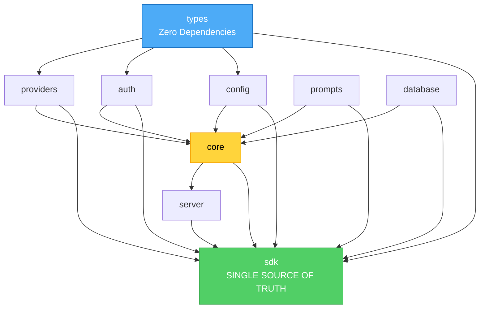

# SDK Architecture - Single Source of Truth

## Overview

The `@agi-cli/sdk` package is the **single, tree-shakable source of truth** for all AGI CLI functionality. It re-exports everything from underlying packages in a clean, organized way.

## Package Structure

```
@agi-cli/
├── types/          ← Foundation (zero dependencies)
│   ├── provider.ts    (ProviderId, ModelInfo)
│   ├── auth.ts        (AuthInfo, OAuth, ApiAuth)
│   └── config.ts      (AGIConfig, ProviderConfig, Scope)
│
├── providers/      ← Provider utilities
│   ├── catalog.ts     (model catalog)
│   ├── utils.ts       (provider helpers)
│   └── pricing.ts     (cost estimation)
│
├── auth/           ← Authentication
│   ├── api.ts         (API key management)
│   └── oauth.ts       (OAuth flows)
│
├── config/         ← Configuration
│   └── manager.ts     (config loading)
│
├── prompts/        ← System prompts
│   └── providers.ts   (provider-specific prompts)
│
├── database/       ← Data persistence
│   └── schema.ts      (drizzle schemas)
│
├── core/           ← Core AI functionality
│   ├── providers/     (model resolution)
│   ├── tools/         (builtin tools)
│   ├── streaming/     (artifacts)
│   └── errors.ts      (error classes)
│
├── server/         ← HTTP API
│   └── routes/        (API endpoints)
│
└── sdk/            ← YOU ARE HERE (single source of truth)
    ├── src/
    │   └── index.ts   (re-exports everything)
    └── README.md      (comprehensive docs)
```

## Dependency Flow



## Import Strategy

### ✅ Recommended: SDK-First

```typescript
// Everything from one place
import { 
  generateText,           // Core AI
  resolveModel,          // Provider resolution
  catalog,               // Provider catalog
  getAuth,               // Authentication
  loadConfig,            // Configuration
  providerBasePrompt,    // Prompts
  getDb,                 // Database
  createServer           // HTTP server
} from '@agi-cli/sdk';

import type { 
  ProviderId,            // Types
  ModelInfo,
  AGIConfig,
  AuthInfo
} from '@agi-cli/sdk';
```

### ❌ Discouraged: Direct Package Imports

```typescript
// Hard to remember which package exports what
import { catalog } from '@agi-cli/providers';
import { generateText } from '@agi-cli/core';
import type { ProviderId } from '@agi-cli/types';
import { getAuth } from '@agi-cli/auth';
```

## Tree-Shaking

The SDK uses **named exports**, making it fully tree-shakable:

```typescript
// Only generateText and its dependencies are bundled
import { generateText } from '@agi-cli/sdk';

// Catalog, auth, database, server NOT included ✅
```

### Bundle Size Example

```typescript
// Minimal import
import { generateText, resolveModel } from '@agi-cli/sdk';

// Estimated bundle: ~150KB (minified)
// Includes: AI SDK, provider resolution, minimal deps
// Excludes: Catalog (large), database, server, auth
```

```typescript
// Everything import
import { 
  generateText,
  catalog,        // +200KB (all model data)
  getDb,          // +50KB (drizzle ORM)
  createServer    // +100KB (hono + routes)
} from '@agi-cli/sdk';

// Estimated bundle: ~500KB (minified)
// Still smaller than bundling entire packages!
```

## Export Organization

The SDK organizes exports into logical sections:

### 1. Types (from `@agi-cli/types`)
- `ProviderId`, `ModelInfo`
- `AuthInfo`, `OAuth`, `ApiAuth`, `AuthFile`
- `AGIConfig`, `ProviderConfig`, `Scope`

### 2. Providers (from `@agi-cli/providers`)
- `catalog` - Complete model catalog
- `isProviderId`, `providerIds` - Provider helpers
- `isProviderAuthorized` - Authorization checks
- `validateProviderModel` - Validation
- `estimateModelCostUsd` - Cost estimation
- `providerEnvVar`, `readEnvKey`, `setEnvKey` - Environment

### 3. Authentication (from `@agi-cli/auth`)
- `getAuth`, `setAuth`, `removeAuth`, `getAllAuth`
- `authorize`, `exchange`, `refreshToken`
- `openAuthUrl`, `createApiKey`

### 4. Configuration (from `@agi-cli/config`)
- `loadConfig`, `readConfig`

### 5. Prompts (from `@agi-cli/prompts`)
- `providerBasePrompt`

### 6. Database (from `@agi-cli/database`)
- `getDb`
- `dbSchema` (namespace export)

### 7. Core AI Functions (from `@agi-cli/core`)

#### AI SDK Re-exports
- `generateText`, `streamText`
- `generateObject`, `streamObject`
- `tool`
- `CoreMessage`, `Tool` (types)

#### Provider & Model Resolution
- `resolveModel`
- `ProviderName`, `ModelConfig` (types)

#### Tools
- `discoverProjectTools`
- `buildFsTools`, `buildGitTools`
- `DiscoveredTool` (type)

#### Streaming & Artifacts
- `createFileDiffArtifact`, `createToolResultPayload`
- `Artifact`, `FileDiffArtifact`, `FileArtifact` (types)

#### Error Handling
- `AGIError`, `AuthError`, `ConfigError`
- `ToolError`, `ProviderError`, `DatabaseError`
- `ValidationError`, `NotFoundError`, `ServiceError`

#### Schema Validation
- `z` (zod re-export)

### 8. Server (from `@agi-cli/server`)
- `createServer` (alias for `createApp`)

## Usage Examples

### Basic Agent
```typescript
import { generateText, resolveModel } from '@agi-cli/sdk';

const model = resolveModel('anthropic', 'claude-3-5-sonnet-20241022');
const { text } = await generateText({ model, prompt: 'Hello!' });
```

### Agent with Tools
```typescript
import { 
  streamText, 
  resolveModel, 
  buildFsTools, 
  buildGitTools 
} from '@agi-cli/sdk';

const tools = { ...buildFsTools(), ...buildGitTools() };
const { textStream } = streamText({
  model: resolveModel('openai', 'gpt-4o'),
  prompt: 'What files are in this directory?',
  tools
});

for await (const chunk of textStream) {
  process.stdout.write(chunk);
}
```

### With Configuration
```typescript
import { generateText, resolveModel, loadConfig } from '@agi-cli/sdk';

const config = await loadConfig();
const model = resolveModel(config.provider, config.model);

const { text } = await generateText({
  model,
  prompt: 'Hello!',
  temperature: config.temperature
});
```

### HTTP Server
```typescript
import { createServer } from '@agi-cli/sdk';

const app = createServer();

export default {
  port: 3000,
  fetch: app.fetch
};
```

## Type Safety

All types are exported and fully documented:

```typescript
import type { 
  // Provider types
  ProviderId,
  ModelInfo,
  
  // Auth types
  AuthInfo,
  OAuth,
  
  // Config types
  AGIConfig,
  ProviderConfig,
  
  // AI types
  CoreMessage,
  Tool,
  
  // Tool types
  DiscoveredTool,
  
  // Artifact types
  Artifact,
  FileDiffArtifact,
  
  // Error types (these are classes, but can be used as types)
  // AGIError, AuthError, etc.
} from '@agi-cli/sdk';
```

## Benefits

### 1. Developer Experience
- **One package to learn** - no need to know package boundaries
- **Consistent imports** - always `from '@agi-cli/sdk'`
- **Auto-complete friendly** - IDE shows all exports
- **Type-safe** - full TypeScript support

### 2. Architecture
- **Zero circular dependencies** - clean, unidirectional flow
- **Clear separation** - types → utilities → core → server → sdk
- **Maintainable** - easy to understand and extend
- **Testable** - packages can be tested in isolation

### 3. Performance
- **Tree-shakable** - only bundle what you use
- **Lazy loading** - import on demand
- **Small bundles** - modern bundlers optimize well
- **Fast builds** - TypeScript can skip unused packages

### 4. Flexibility
- **Direct imports still work** - gradual migration possible
- **Package isolation** - internal code can use direct imports
- **SDK is optional** - not required for internal package development

## Migration Path

### For Application Code
Use SDK imports exclusively:
```typescript
import { ... } from '@agi-cli/sdk';
```

### For Package Development
Internal packages can import directly for isolation:
```typescript
// In @agi-cli/core/src/providers/resolver.ts
import type { ProviderId } from '@agi-cli/types';
import { catalog } from '@agi-cli/providers';
// NOT from '@agi-cli/sdk' - maintain package boundaries
```

### For Examples & Docs
Always use SDK to show best practices:
```typescript
import { generateText, resolveModel } from '@agi-cli/sdk';
```

## Future Enhancements

1. **Subpath Exports** - For advanced use cases:
   ```typescript
   import { buildFsTools } from '@agi-cli/sdk/tools/fs';
   import { catalog } from '@agi-cli/sdk/providers';
   ```

2. **Bundle Analysis** - CI monitoring:
   ```bash
   bun run analyze-bundle
   # Shows tree-shaking effectiveness
   ```

3. **Auto-generated Docs** - From TypeScript types:
   ```bash
   bun run docs:generate
   # Creates API reference from exports
   ```

## Summary

The `@agi-cli/sdk` is now the **single, tree-shakable source of truth** for AGI CLI:

- ✅ All functionality in one place
- ✅ Tree-shakable named exports
- ✅ Zero circular dependencies
- ✅ Comprehensive TypeScript support
- ✅ Excellent developer experience

**Use the SDK for all application code. Direct package imports are only for internal package development.**
