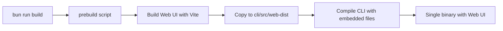

# Web UI Embedding in CLI

This document describes how the web UI is built and embedded into the AGI CLI binary.

## Overview

The AGI CLI now includes an embedded web UI that is automatically served when you run `agi serve`. This provides a modern, browser-based interface for interacting with AGI alongside the API server.

## Architecture

### Components

1. **Build Script** (`scripts/build-web.ts`)
   - Builds the React-based web UI using Vite
   - Copies the built static files to `apps/cli/src/web-dist`
   - Automatically runs before CLI compilation

2. **Web Server Module** (`apps/cli/src/web-server.ts`)
   - Resolves assets from the generated manifest (`web-assets.ts`)
   - Falls back to embedded base64 blobs when files are not on disk
   - Injects the AGI server URL dynamically into `index.html`
   - Handles MIME types and caching for optimal performance

3. **Serve Command** (Updated in `apps/cli/index.ts`)
   - Starts the AGI API server on the specified port (default: 9100)
   - Starts the Web UI server on the next port (AGI port + 1)
   - Both servers run simultaneously

### Port Assignment

- **AGI Server**: Uses `--port` flag or `PORT` env var (default: 9100)
- **Web UI Server**: Automatically uses AGI server port + 1 (e.g., if AGI is on 9100, Web UI is on 9101)

## Build Process

### Development

When developing the web UI:

```bash
# Work on the web UI
cd apps/web
bun run dev
```

### Building the CLI with Embedded Web UI

The web UI is automatically built before the CLI is compiled:

```bash
# Build for current platform (prebuild script runs automatically)
cd apps/cli
bun run build

# Build for specific platforms
bun run build:darwin-arm64
bun run build:linux-x64
bun run build:windows-x64
```

The build process:
1. Runs `scripts/build-web.ts` (via `prebuild` npm script)
2. Builds the web UI with Vite
3. Copies built files to `apps/cli/src/web-dist`
4. Generates `web-assets.ts` with embedded base64 payloads
5. Compiles the CLI and serves assets from either disk or the embedded blobs

### Manual Web UI Build

To build just the web UI:

```bash
bun run scripts/build-web.ts
```

## How It Works

### 1. Build Time



### 2. Runtime

When you run `agi serve`:

1. **AGI Server**: Starts on the specified port
2. **Web UI Server**: Starts on the next port
3. **URL Injection**: The AGI server URL is injected into `index.html`
4. **Configuration**: Web UI reads `window.AGI_SERVER_URL` to connect to the API

```typescript
// In apps/web/src/lib/config.ts
export const API_BASE_URL =
  import.meta.env.VITE_API_BASE_URL ||
  (window as AGIWindow).AGI_SERVER_URL ||
  'http://localhost:9100';
```

### 3. File Embedding

During `prebuild`, `scripts/build-web.ts` collects every asset, converts it to base64, and writes `apps/cli/src/web-assets.ts`. At runtime the server reads from disk when available (development) and otherwise uses the embedded bytes (compiled binary).

## Usage

### Starting the Servers

```bash
# Start both AGI server and Web UI
agi serve

# Start on a specific port
agi serve --port 4545
# AGI server: http://localhost:4545
# Web UI: http://localhost:4546
```

### Example Output

```
🚀 agi server listening on http://localhost:9100
🌐 Web UI available at http://localhost:9101
```

## Development Workflow

### 1. Working on the Web UI

```bash
# Terminal 1: Run AGI server
agi serve

# Terminal 2: Run web UI in dev mode (with hot reload)
cd apps/web
bun run dev
```

The dev server will use `VITE_API_BASE_URL` or default to `http://localhost:9100`.

### 2. Testing the Embedded Version

```bash
# Build and test
cd apps/cli
bun run build
./dist/agi serve
```

## File Structure

```
agi/
├── apps/
│   ├── cli/
│   │   ├── src/
│   │   │   ├── web-server.ts       # Web UI server implementation
│   │   │   └── web-dist/           # Built web UI (gitignored)
│   │   │       ├── assets/
│   │   │       ├── index.html
│   │   │       └── vite.svg
│   │   ├── index.ts                # Main CLI entry (updated)
│   │   └── package.json            # Build scripts
│   └── web/
│       ├── src/
│       │   └── lib/
│       │       └── config.ts       # API URL configuration
│       └── package.json
└── scripts/
    └── build-web.ts                # Web UI build script
```

## Configuration

### Environment Variables

**Development:**
- `VITE_API_BASE_URL`: Override the API server URL in development

**Production:**
- `PORT`: Set the AGI server port (Web UI will be PORT + 1)

### Build Configuration

The build process is configured in `apps/cli/package.json`:

```json
{
  "scripts": {
    "prebuild": "bun run ../../scripts/build-web.ts",
    "build": "bun run prebuild && bun build --compile ./index.ts --outfile dist/agi"
  }
}
```

## Troubleshooting

### Web UI Not Loading

1. **Check if web-dist exists**: `ls apps/cli/src/web-dist/`
2. **Rebuild the web UI**: `bun run scripts/build-web.ts`
3. **Check console errors**: Open browser DevTools

### Port Conflicts

If the Web UI port (AGI port + 1) is already in use:
- Change the AGI server port: `agi serve --port 8080`
- The Web UI will automatically use 8081

### API Connection Issues

Check that the Web UI is connecting to the correct API URL:
1. Open browser DevTools → Console
2. Look for `window.AGI_SERVER_URL`
3. Verify it matches your AGI server URL

## Future Enhancements

Potential improvements:
- [ ] Custom port flag for Web UI (e.g., `--web-port`)
- [ ] Disable Web UI option (e.g., `--no-web`)
- [ ] Better error handling for missing web-dist
- [ ] WebSocket support for real-time updates
- [ ] Authentication/authorization for Web UI

## Related Files

- `scripts/build-web.ts` - Web UI build script
- `apps/cli/src/web-server.ts` - Web server implementation
- `apps/cli/index.ts` - Serve command integration
- `apps/web/src/lib/config.ts` - Web UI API configuration
- `.gitignore` - Excludes `apps/cli/src/web-dist`
